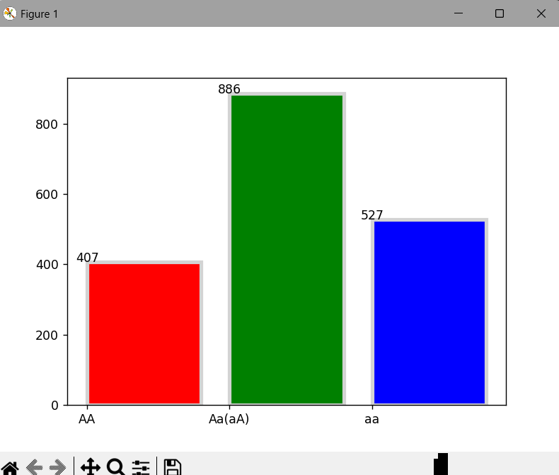
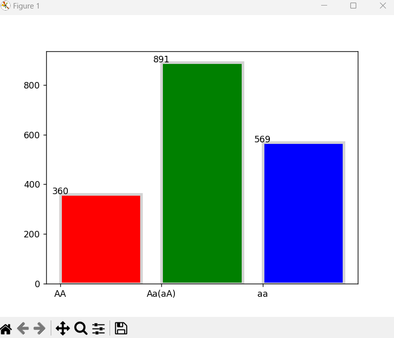
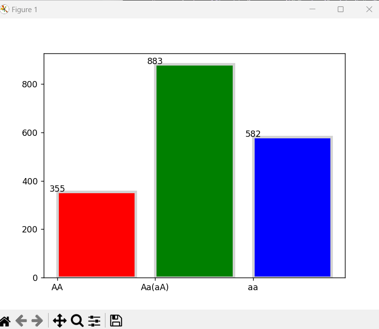
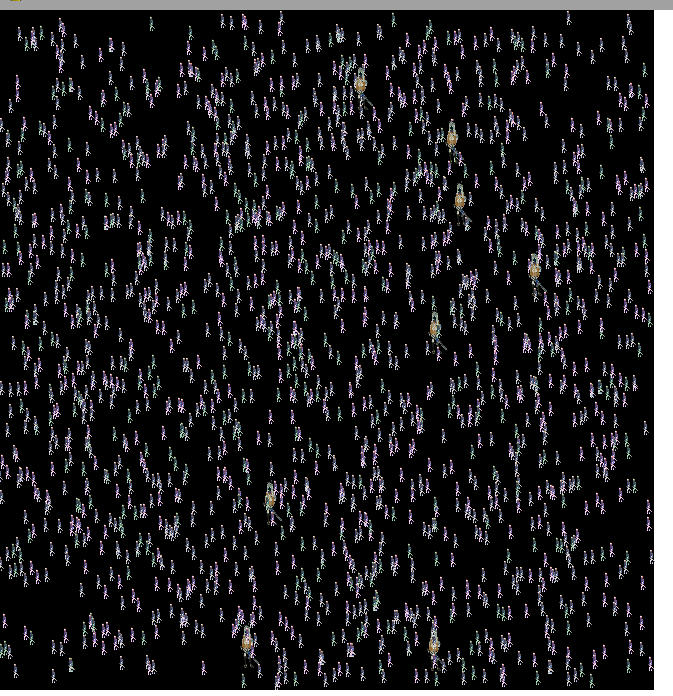
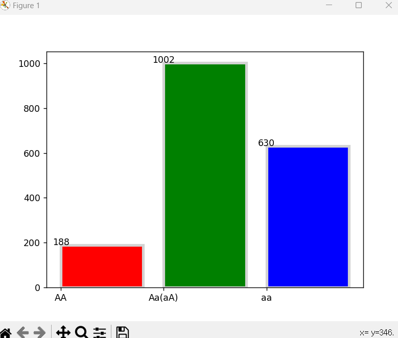
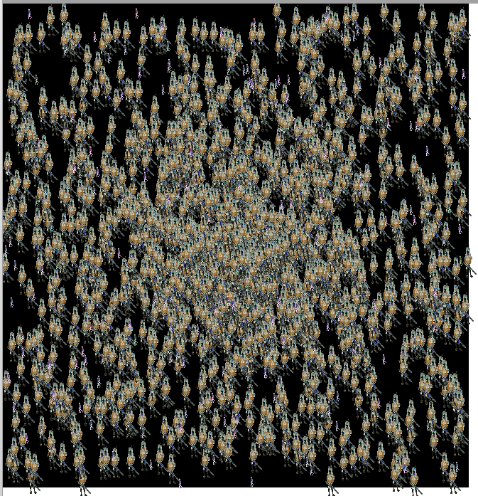

# 1. requirement

1. python 3.11.4
2. packages
   > use the Command ```pip install -r requirements.txt```
   


# 2. take care
1. dont move graph window (make error and shut down.)

# 3. what is **Hardy-Weinberg principle**

>In population genetics, the Hardy–Weinberg principle, also known as the Hardy–Weinberg equilibrium, model, theorem, or law, states that allele and genotype frequencies in a population will remain constant from generation to generation in the absence of other evolutionary influences. These influences include genetic drift, mate choice, assortative mating, natural selection, sexual selection, mutation, gene flow, meiotic drive, genetic hitchhiking, population bottleneck, founder effect, inbreeding and outbreeding depression. [ from wikipedia ]

The seven assumptions underlying Hardy–Weinberg equilibrium are as follows:

organisms are diploid  
only sexual reproduction occurs  
generations are nonoverlapping  
mating is random  
population size is infinitely large  
allele frequencies are equal in the sexes  
there is no migration, gene flow, admixture, mutation or selection  


# 4. How Proceed Experiment?
### Experiment 1.
1. set a gene Pool
    > Ex.   
    > AA gene Entity Amount : 500  
    >Aa(aA) gene Entity Amount : 700  
    >aa gene Entity Amount : 620
 
    > *notice*  
    >  - the more entity, the better result
2.  run simulation
3.  when each phase done, check graph and compare phase 1
4.  repeat until you want (reference repeat until phase 20)
---
### Experiment 2.
5.  click the screen while entity moves, it makes super entity that is in red circle
    > what is super entity?  
    > - 1. faster
    > - 2. bigger
    > - 3. The gene of the super entity is inherited unconditionally.
6. repeat until you want.(reference repeat until phase 30)
7. compare with phase 1

# 5. Expected result?

*Experiment 3* shows that **the proportion of each gene pool remains nearly constant**

phase1  


phase2  


> the proportion nearly constant.


 *Experiment 2* show that **the proportion of each gene pool remains nearly inconstant**


phase21  

  
  
phase30  




---

it means, when in Mendelian population, the proportion of each gene pool constant. also means not in Mendelian population(By allowing natural selection to occur), the proportion of each gene pool unconstant.
# 6. Reslt Error

but real ratio has diffrence.
i think this is caused by using "PRNG" (Pseudo-Random Number Generator).
in principle, the randomness of transmission is truly random but,
in program we use just pseudo random protocol. so it occured, i think
